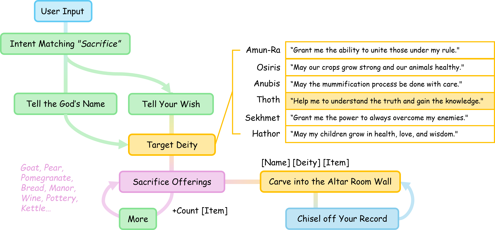

# High Priest of Luxor: A Sacrificial Offering Agent

## Overview


The **High Priest** chatbot is designed to assist users in engaging with ancient Egyptian cultural and spiritual practices, particularly within the context of the Luxor Temple in Thebes. The chatbot facilitates sacrificial offerings to various Egyptian deities, ensuring that rituals align with historical traditions. By leveraging machine learning, semantic understanding, and vectorization techniques, the chatbot provides a natural, intuitive, and immersive user experience.

## Features

### Intent Matching


The chatbot classifies user intentions into **ten distinct intent types**:

1. **Small Talk** – General conversation.
2. **Name Management** – Handling user names.
3. **Question Answering** – Providing information about deities and rituals.
4. **Time** – Managing time-based interactions.
5. **Sacrifice (Transaction)** – Initiating sacrificial offerings.
6. **Check Sacrifice (Check Transaction)** – Reviewing past sacrifices.
7. **Chisel off the Sacrifice (Delete the Transaction Record)** – Removing sacrifice records.
8. **Bye** – Exiting the interaction.
9. **Yes** – Confirmations.
10. **No** – Rejections.

The intent matching system is implemented using **TF-IDF vectorization** and a **logistic regression model**, making it more flexible and scalable than traditional rule-based approaches.

### Sacrificial Offering System



- Users can **dedicate offerings** to Egyptian deities through a structured **Sacrifice Pipeline**.
- The chatbot assists users in **identifying the appropriate deity** based on their prayers.
- Recognized deities include:
  - **Amun-Ra** – Kingship
  - **Osiris** – Agriculture
  - **Anubis** – Mummification
  - **Thoth** – Wisdom
  - **Sekhmet** – War and Strength
  - **Hathor** – Love
- The system records offerings and provides an option to inscribe them on an altar wall.
- Users can review and delete their past offerings.

### Information Retrieval & Question Answering

- Uses **TF-IDF vectorization** and **cosine similarity** to retrieve relevant information.
- Queries are compared to a dataset of frequently asked questions to ensure accurate responses.

### Small Talk Functionality

- Employs **semantic matching** to provide relevant responses to casual interactions.
- Uses a dataset of predefined question-answer pairs.

### User Experience Enhancements

#### **Prompt Design**

- Uses contextually appropriate phrases like *"Welcome to the Royal Temple of Luxor!"*
- Incorporates **structured prompts** and **emoji-based engagement**.

#### **Discoverability**

- Provides **contextual guidance** and clear descriptions of available functionalities.
- Helps users explore options such as learning about deities, performing offerings, or seeking divine guidance.

#### **Error Handling**

- Provides **gentle prompts** to guide users back on track.
- Enforces structured input formats to avoid confusion (e.g., numeric input for sacrifices).

#### **Personalization**

- Addresses users by name for an **immersive experience**.
- Allows **name modification** through **semantic matching**.
- Adapts responses based on user actions and preferences.

#### **Confirmation Mechanism**

- Ensures users verify their actions before proceeding (e.g., *"Are you sure to sacrifice 22 jars of grape wine from Crete to Osiris?"*).
- Provides **clear acknowledgments** upon completion.

#### **Context Awareness**

- Maintains continuity by remembering past interactions.
- Allows users to check prior contributions (e.g., *"Thou hast offered 22 jars of grape wine from Crete unto Osiris."*).

## Technologies Used

- **Machine Learning:** Logistic regression model for intent matching.
- **Vectorization Techniques:** TF-IDF for text processing.
- **Semantic Understanding:** Context-aware responses for a smooth conversational flow.
- **Data Storage:** JSON for transaction records; CSV for information retrieval.

## Installation & Usage

1. Clone the repository:
   ```sh
   git clone https://github.com/your-repository/high-priest-chatbot.git
   cd high-priest-chatbot
   ```
2. Install dependencies:
   ```sh
   pip install -r requirements.txt
   ```
3. Run the chatbot:
   ```sh
   python high_priest.py
   ```
4. Interact with the chatbot by following prompts and exploring different functionalities.

## Future Enhancements

- **Multilingual Support** to cater to a wider audience.
- **Voice Interaction** for a more immersive experience.
- **Enhanced Knowledge Base** for deeper engagement with Egyptian mythology.
- **Integration with AR/VR** for temple simulation experiences.

## Contributing

Contributions are welcome! Feel free to submit issues, feature requests, or pull requests to improve the High Priest chatbot.

## License

This project is licensed under the MIT License.
